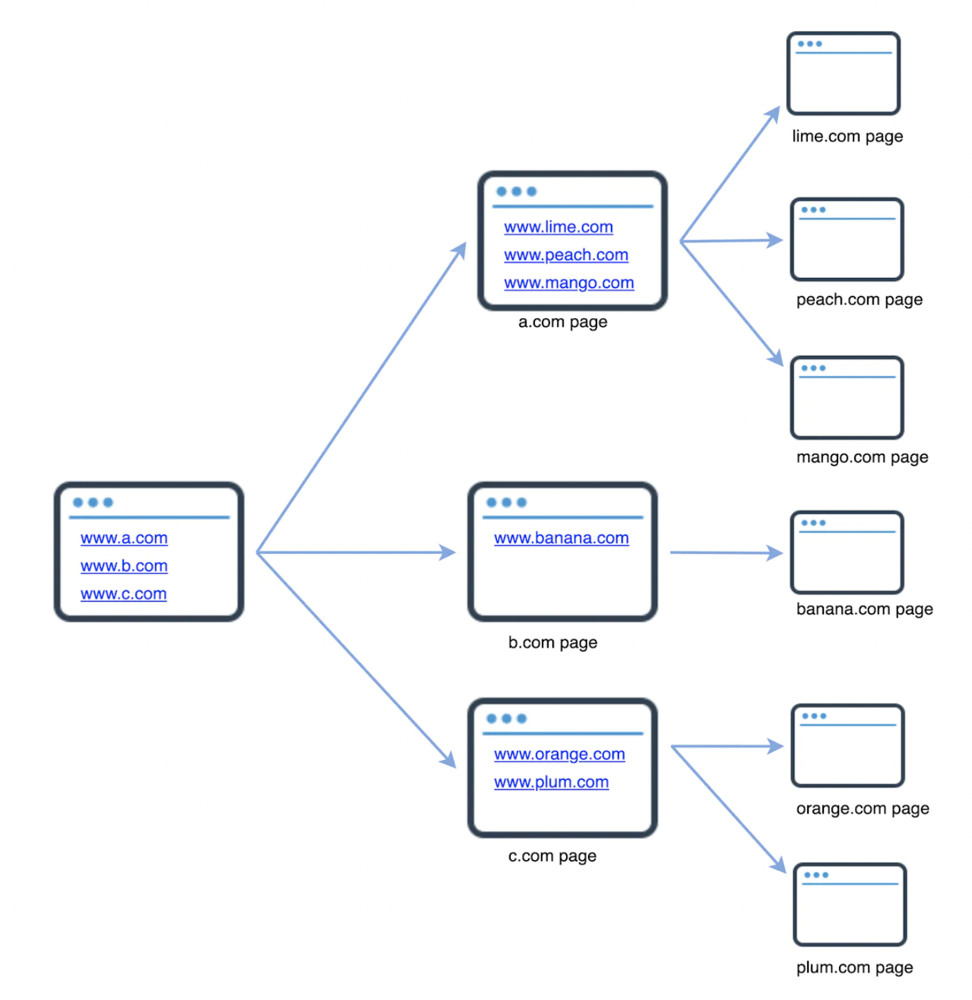
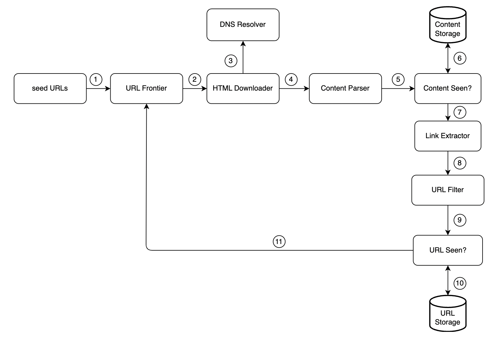
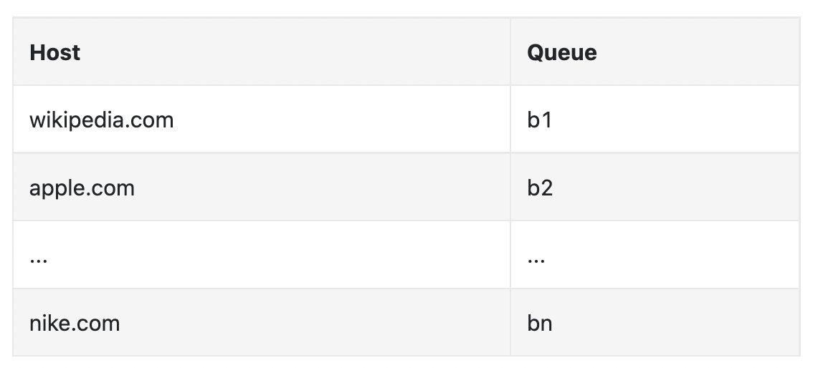

# Design a Web Crawler
We'll focus next on designing a web crawler - a classical system design problem.

Web crawlers (aka robots) are used to discover new or updated content on the web, such as articles, videos, PDFs, etc.


## Use-cases:
 - Search engine indexing - for creating a local index of a search engine, eg Google's Googlebot.
 - Web archiving - collect data from the web and preserve it for future uses. 
 - Web mining - it can also be used for data mining. Eg finding important insights such as shareholder meetings for trading firms.
 - Web monitoring - monitor the internet for copyright infringements or eg company internal information leaks.

The complexities of building a web crawler depend on our target scale. It can be very simple (eg a student project) or a multi-year project, maintained by a dedicated team.

## Step 1 - Understand the problem and establish design scope
How it works at a high-level:

 - Given a set of URLs, download all the pages these URLs point to
 - Extract URLs from the web pages
 - Add the new URLs to the list of URLs to be traversed

A real web crawler is much more complicated, but this is what it does in a nutshell.

You'll need to clarify what kind of features your interviewer would like you to support exactly:

 - C: What's the main purpose of the web crawler? Search engine indexing, data mining, something else?
 - I: Search engine indexing
 - C: How many web pages does it collect per month
 - I: 1 billion
 - C: What content types are included? HTML, PDF, images?
 - I: HTML only
 - C: Should we consider newly added/edited content?
 - I: Yes
 - C: Do we need to persist the crawled web pages?
 - I: Yes, for 5 years
 - C: What do we do with pages with duplicate content
 - I: Ignore them

This is an example conversation. It is important to go through this even if the project is simple. Your assumptions and the ones of your interviewer could differ.

Other characteristics of a good web crawler:

 - Scalable - it should be extremely efficient
 - Robust - handle edge-cases such as bad HTML, infinite loops, server crashes, etc
 - Polite - not make too many requests to a server within a short time interval
 - Extensibility - it should be easy to add support for new types of content, eg images in the future

### Back of the envelope estimation
Given 1 billion pages per month -> ~400 pages per second
Peak QPS = 800 pages per second

Given average web page size is 500kb -> 500 TB per month -> 30 PB for 5y.

## Step 2 - Propose high-level design and get buy-in


What's going on in there?

 - Seed URLs - These URLs are the starting point for crawlers. It's important to pick the seed URLs well in order to traverse the web appropriately.
 - URL Frontier - This component stores the URLs to be downloaded in a FIFO queue.
 - HTML Downloader - component downloads HTML pages from URLs in the frontier.
 - DNS Resolver - Resolve the IP for a given URL's domain.
 - Content Parser - validate that the web page is ok. You don't want to store & process malformed web pages.
 - Content Seen? - component eliminates pages which have already been processed. This compares the content, not the URLs. Efficient way to do it is by comparing web page hashes.
 - Content Storage - Storage system for HTML documents. Most content is stored on disk \w most popular ones in memory for fast retrieval.
 - URL Extractor - component which extracts links from an HTML document.
 - URL Filter - exclude URLs which are invalid, unsupported content types, blacklisted, etc.
 - URL Seen? - component which keeps track of visited URLs to avoid traversing them again. Bloom filters are an efficient way to implement this component.
 - URL Storage - Store already visited URLs.

Those are all the component, but what about the workflow?


 1. Add Seed URLs to URL Frontier
 2. HTML Downloader fetches a list of URLs from frontier
 3. Match URLs to IP Addresses via the DNS resolver
 4. Parse HTML pages and discard if malformed
 5. Once validated, content is passed to "Content Seen?"
 6. Check if HTML page is already in storage. If yes - discard. If no - process.
 7. Extract links from HTML page
 8. Pass extracted links to URL Filter
 9. Pass filtered links to "URL Seen?" component
 10. If URL is in storage - discard. Otherwise - process.
 11. If URL is not processed before, it is added to URL Frontier

## Step 3 - Design Deep Dive
Let's now explore some of the most important mechanisms in the web crawler:
 - DFS vs. BFS
 - URL frontier
 - HTML Downloader
 - Robustness
 - Extensibility
 - Detect and avoid problematic content

### DFS vs. BFS
The web is a directed graph, where the links in a web page are the edges to other pages (the nodes).

Two common approaches for traversing this data structure are DFS and BFS. 
DFS is usually not a good choice as the traversal depth can get very big

BFS is typically preferable. It uses a FIFO queue which traverses URLs in order of encountering them.

There are two problems with traditional BFS though:

 - Most links in a page are backlinks to the same domain, eg wikipedia.com/page -> wikipedia.com. 
   When a crawler attempts to visit those links, the server is flooded with requests which is "impolite".
 - Standard BFS doesn't take URL priority into account

### URL Frontier
The URL Frontier helps address these problems. It prioritizes URLs and ensures politeness.

#### Politeness
A web crawler should avoid sending too many requests to the same host in a short time frame as it can cause excessive traffic to traversed website.

Politeness is implemented by maintaining a download queue per hostname \w a delay between element processing:


 - The queue router ensures that each queue contains URLs from the same host.
 - Mapping table - maps each host to a queue.

 - FIFO queues maintain URLs belonging to the same host.
 - Queue selector - Each worker thread is mapped to a FIFO queue and only downloads URLs from that queue. Queue selector chooses which worker processes which queue.
 - Worker thread 1 to N - Worker threads download web pages one by one from the same host. Delay can be added between two download tasks.

#### Priority
We prioritize URLs by usefulness, which can be determined based on PageRank web traffic, update frequency, etc.

Prioritizer manages the priority for each URL:


 - Takes URLs as input and calculates priority
 - Queues have different priorities. URLs are put into respective queue based on its priority.
 - Queue selector - randomly choose queue to select from with bias towards high-priority ones.
 
#### Freshness
Web pages are constantly updated. We need to periodically recrawl updated content.

We can choose to recrawl based on the web page's update history. We can also prioritize recrawling important pages which are updated first.

#### Storage for URL Frontier
In the real world, the URLs in the frontier can be millions. Putting everything in-memory is infeasible.
But putting it on disk is also slow and can cause a bottleneck for our crawling logic.

We've adopted a hybrid approach where most URLs are on disk, but we maintain a buffer in-memory with URLs which are currently processed.
We periodically flush that to disk.

### HTML Downloader
This component downloads HTML pages from the web using the HTTP protocol.

One protocol we need to also bear in mind is the Robots Exclusion Protocol.

It is a `robots.txt` file, available on websites, which website owners use to communicate with web crawlers.
It is used to communicate which web pages are ok to be traversed and which ones should be skipped.

It looks like this:
```yaml
User-agent: Googlebot
Disallow: /creatorhub/\*
Disallow: /rss/people/\*/reviews
Disallow: /gp/pdp/rss/\*/reviews
Disallow: /gp/cdp/member-reviews/
Disallow: /gp/aw/cr/
```
 
We need to respect that file and avoid crawling the pages specified in there. We can cache it to avoid downloading it all the time.

#### Performance optimization
Some performance optimizations we can consider for the HTML downloader.

 - Distributed crawl - We can parallelize crawl jobs to multiple machines which run multiple threads to crawl more efficiently.

 - Cache DNS Resolver - We can maintain our own DNS cache to avoid making requests to the DNS resolver all the time, which can be costly. It's updated periodically by cron jobs.
 - Locality - We can distribute crawl jobs based on geography. When crawlers are physically closer to website servers, latency is lower.
 - Short timeout - We need to add a timeout in case servers are unresponsive beyond a given threshold. Otherwise, our crawlers can spend a lot of time waiting for pages which will never come.

### Robustness
Some approaches to achieve robustness:

 - Consistent hashing - To enable easy rescaling of our workers/crawlers/etc, we can use consistent hashing when load balancing jobs among them.
 - Save crawl state and data - In the event of server crashes, it would be useful to store intermediary results on disk so that other workers can pick up from where the last one left.
 - Exception handling - We need to handle exceptions gracefully without crashing the servers as these are inevitable in a large enough system.
 - Data validation - important safety measure to prevent system errors.

### Extensibility
We need to ensure the crawler is extendable if we want to support new content types in the future:


Example extensions:
 - PNG Downloader is added in order to crawl PNG images.
 - Web monitor is added to monitor for copyright infringements.

### Detect and avoid problematic content
Some common types of problematic content to be aware of:

 - Redundant content - ~30% of web pages on the internet are duplicates. We need to avoid processing them more than once using hashes/checksums.
 - Spider traps - A web page which leads to an infinite loop on the crawler, eg an extremely deep directory structure. This can be avoided by specifying a max length for URLs. But there are other sorts of spider traps as well. We can introduce the ability to manually intervene and blacklist spider trap websites.
 - Data noise - Some content has no value for our target use-case. Eg advertisements, code snippets, spam, etc. We need to filter those.

## Step 4 - Wrap up
Characteristics of a good crawler - scalable, polite, extensible, robust.

Other relevant talking points:

- Server-side rendering - Numerous sites dynamically generate HTML. If we parse the HTML without generating it first, we'll miss the information on the site. To solve this, we do server-side rendering first before parsing a page.
 - Filter out unwanted pages - Anti-spam component is beneficial for filtering low quality pages.
 - Database replication and sharding - useful techniques to improve the data layer's availability, scalability, reliability.
 - Horizontal scaling - key is to keep servers stateless to enable horizontally scaling every type of server/worker/crawler/etc.
 - Availability, consistency, reliability - concepts at the core of any large system's success.
 - Analytics - We might also have to collect and analyze data in order to fine tune our system further.
