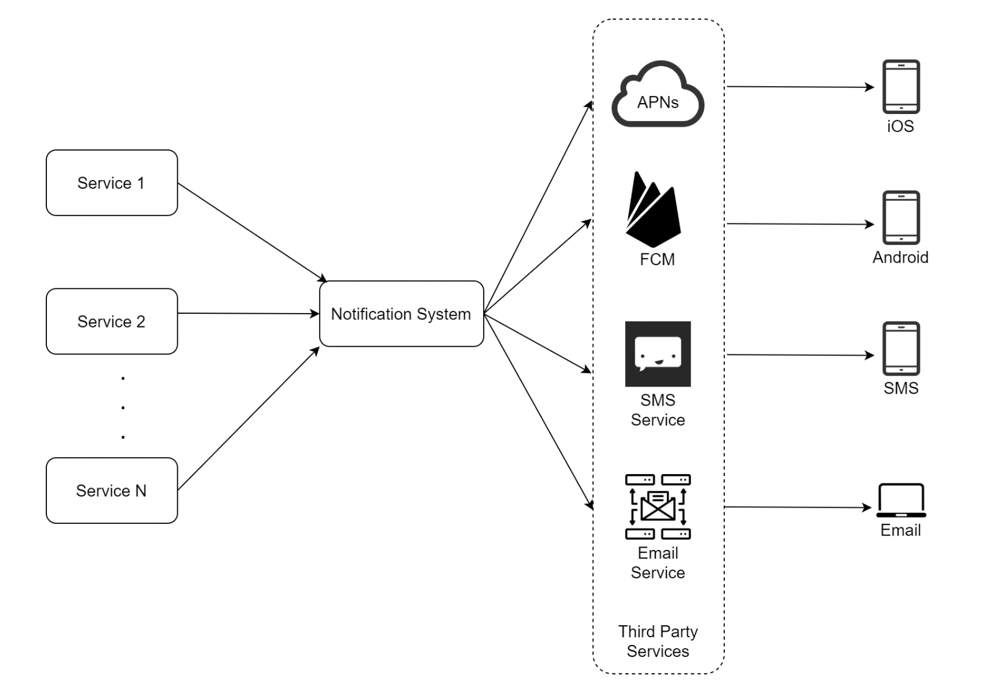
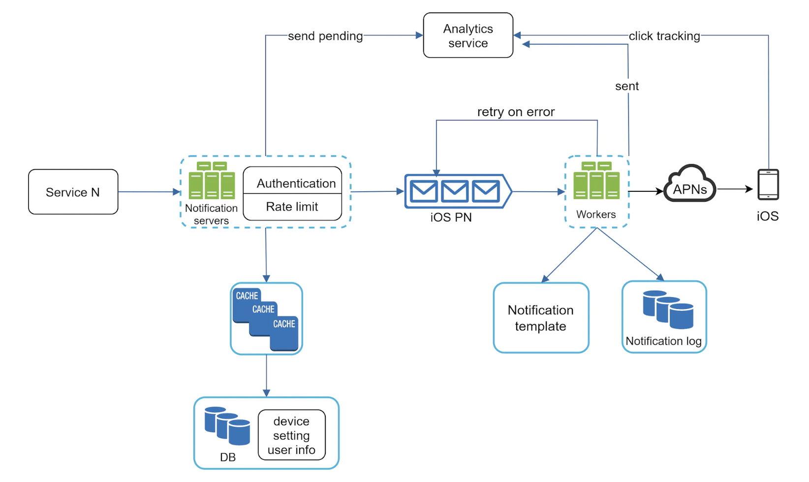

# Design a Notification System
Notification systems are a popular feature in many applications - it alerts a user for important news, product updates, events, etc.

There are multiple flavors of a notification:
 - Mobile push notification
 - SMS
 - Email

# Step 1 - Understand the problem and establish design scope
 - C: What types of notifications does the system support?
 - I: Push notifications, SMS, Email
 - C: Is it a real-time system?
 - I: Soft real-time. We want user to receive notification as soon as possible, but delays are okay if system is under high load.
 - C: What are the supported devices?
 - I: iOS devices, android devices, laptop/desktop.
 - C: What triggers notifications?
 - I: Notifications can be triggered by client applications or on the server-side.
 - C: Will users be able to opt-out?
 - I: Yes
 - C: How many notifications per day?
 - I: 10mil mobile push, 1mil SMS, 5mil email

# Step 2 - Propose high-level design and get buy-in
This section explores the high-level design of the notification system.

## Different types of notifications
How do the different notification types work at a high level?

### iOS push notification

 
- Provider - builds and sends notification requests to Apple Push Notification Service (APNS). To do that, it needs some inputs:
   - Device token - unique identifier used for sending push notifications 
   - Payload - JSON payload for the notification, eg:

```json
{
   "aps":{
      "alert":{
         "title":"Game Request",
         "body":"Bob wants to play chess",
         "action-loc-key":"PLAY"
      },
      "badge":5
   }
}
```
 - APNS - service, provided by Apple for sending mobile push notifications
 - iOS Device - end client, which receives the push Notifications

### Android Push Notification
Android adopts a similar approach. A common alternative to APNS is Firebase Cloud Messaging:


### SMS Message
For SMS, third-party providers like Twilio are available:


### Email
Although clients can setup their own mail servers, most clients opt-in to use third-party services, like Mailchimp:


Here's final design after including all notification providers:


## Contact info gathering form
In order to send notifications, we need to gather some inputs from the user first. That is done at user signup:


Example database tables for storing contact info:


## Notification sending/receiving flow
Here's the high-level design of our notification system:

 - Service 1 to N - other services in the system or cron jobs which trigger notification sending events.
 - Notification system - accepts notification sending messages and propagates to the correct provider.
 - Third-party services - responsible for delivering the messages to the correct users via the appropriate medium. This part should be build \w extensibility in case we change third-party service providers in the future.
 - iOS, Android, SMS, Email - Users receive notifications on their devices.

Some problems in this design:
 - Single point of failure - only a single notification service
 - Hard to scale - since notification system handles everything, it is hard to independently scale eg the cache/database/service layer/etc.
 - Performance bottleneck - handling everything in one system can be a bottleneck especially for resource-intensive tasks such as building HTML pages.

## High-level design (improved)
Some changes from the original naive design:
 - Move database & cache out of the notification service
 - Add more notification servers & setup autoscaling & load balancing
 - Introduce message queues to decouple system components


 - Service 1 to N - services which send notifications within our system
 - Notification servers - provide APIs for sending notifications. Visible to internal services or verified clients. Do basic validation. Fetch notification templates from database. Put notification data in message queues for parallel processing.
 - Cache - user info, device info, notification templates
 - DB - stores data about users, notifications, settings, etc.
 - Message queues - Remove dependencies across components. They serve as buffers for notifications to be sent out. Each notification provider has a different message queue assigned to avoid outages in one third-party provider to affect the rest.
 - Workers - pull notification events from message queues and send them to corresponding third-party services.
 - Third-party services - already covered in initial design.
 - iOS, Android, SMS, Email - already covered in initial design.

Example API call to send an email:
```json
{
   "to":[
      {
         "user_id":123456
      }
   ],
   "from":{
      "email":"from_address@example.com"
   },
   "subject":"Hello World!",
   "content":[
      {
         "type":"text/plain",
         "value":"Hello, World!"
      }
   ]
}
```

Example lifecycle of a notification:
 - Service makes a call to make a notification
 - Notification service fetch metadata (user info, settings, etc) from database/cache 
 - Notification event is sent to corresponding queue for processing for each third-party provider.
 - Workers pull notifications from the message queues and send them to third-party services.
 - Third-party services deliver nofications to end users.

# Step 3 - Design deep dive
In this section, we discuss some additional considerations for our improved design.

## Reliability
Some questions to consider in terms of making the system reliable:
 - What happens in the event of data loss?
 - Will recipients receive notifications exactly once?

To avoid data loss, we can persist notifications in a notification log database on the workers, which retry them in case a notification doesn't go through:


What about duplicate notifications?

It will occasionally happen as we can't guarantee exactly-once delivery (unless the third-party API provides idempotency keys).
If they don't we can still try to reduce probability of this happening by having a dedup mechanism on our end, which discards an event id if it is already seen.

## Additional components and considerations
### Notification templates
To avoid building every notification from scratch on the client side, we'll introduce notification templates as many notifications can reuse them:

```
BODY:
You dreamed of it. We dared it. [ITEM NAME] is back — only until [DATE].

CTA:
Order Now. Or, Save My [ITEM NAME]
```

### Notification setting
Before sending any notification, we first check if user has opted in for the given communication channel via this database table:
```
user_id bigInt
channel varchar # push notification, email or SMS
opt_in boolean # opt-in to receive notification
```

### Rate limiting
To avoid overwhelming users with too many notifications, we can introduce some client-side rate limiting (on our end) so that they don't opt out of notifications immediately once they get bombarded.

### Retry mechanism
If a third-party provider fails to send a notification, it will be put into a retry queue. If problem persists, developers are notified.

### Security in push notifications
Only verified and authenticated clients are allowed to send push notifications through our APIs. We do this by requiring an appKey and appSecret, inspired by Android/Apple notification servers.

### Monitor queued notifications
A critical metric to keep track of is number of queued notifications. If it gets too big, we might have to add more workers:


### Events tracking
We might have to track certain events related to a notification, eg open rate/click rate/etc.

Usually, this is done by integrating with an Analytics service, so we'll need to integrate our notification system with one.


## Updated design
Putting everything together, here's our final design:


Other features we've added:
 - Notification servers are equipped with authentication and rate limiting.
 - Added a retry mechanism to handle notification failures.
 - Notification templates are added to provide a coherent notification experience.
 - Monitoring and tracking systems are added to keep track of system health for future improvements.

# Step 4 - Wrap up
We introduced a robust notification system which supports push notifications, sms and email. We introduced message queues to decouple system components.

We also dug deeper into some components and optimizations:
 - Reliability - added robust retry mechanism in case of failures
 - Security - Appkey/appSecret is used to ensure only verified clients can make notifications.
 - Tracking and monitoring - implemented to monitor important stats.
 - Respect user settings - Users can opt-out of receiving notifications. Service checks the user settings first, before sending notifications.
 - Rate limiting - Users would appreciate if we don't bombard them with a dozen of notifications all of a sudden.
