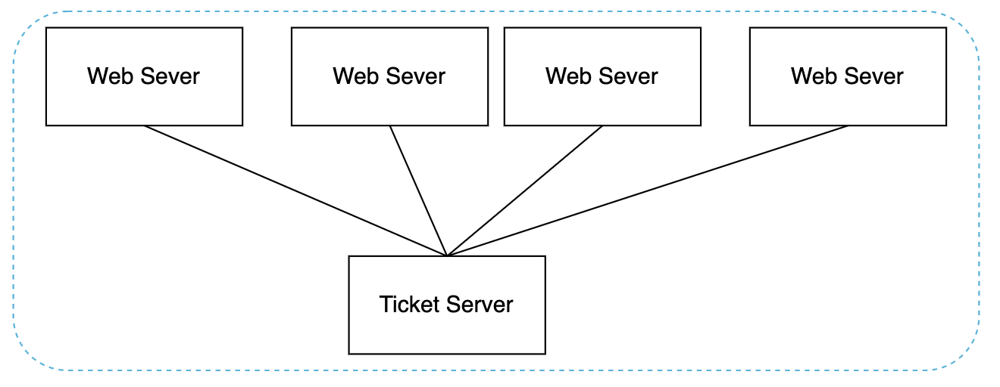
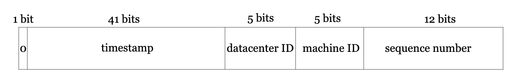

# Design a Unique ID Generator in Distributed Systems
We need to design a unique ID generator, compatible with distributed systems.

A primary key with auto_increment won't work here, because generating IDs across multiple database servers has high latency.

# Step 1 - Understand the problem and establish design scope
 * C: What characteristics should the unique IDs have?
 * I: They should be unique and sortable.
 * C: For each record, does the ID increment by 1?
 * I: IDs increment by time, but not necessarily by 1.
 * C: Do IDs contain only numerical values?
 * I: Yes
 * C: What is the ID length requirement?
 * I: 64 bits
 * C: What's the system scale?
 * I: We should be able to generate 10,000 IDs per second

# Step 2 - Propose high-level design and get buy-in
Here's the options we'll consider:
 * Multi-master replication
 * Universally-unique IDs (UUIDs)
 * Ticket server
 * Twitter snowflake approach

## Multi-master replication


This uses the database's auto_increment feature, but instead of increasing by 1, we increase by K where K = number of servers.

This solves the scalability issues as id generation is confined within a single server, but it introduces other challenges:
 * Hard to scale \w multiple data centers
 * IDs do not go up in time across servers
 * Adding/removing servers breaks this mechanism

## UUID
A UUID is a 128-byte unique ID.

The probability of UUID collision across the whole world is very little.

Example UUID - `09c93e62-50b4-468d-bf8a-c07e1040bfb2`.

Pros:
 * UUIDs can be generated independently across servers without any synchronization or coordination.
 * Easy to scale.

Cons:
 * IDs are 128 bytes, which doesn't fit our requirement
 * IDs do not increase with time
 * IDs can be non-numeric

## Ticket server
A ticket server is a centralized server for generating unique primary keys across multiple services:


Pros:
 * Numeric IDs
 * Easy to implement & works for small & medium applications

Cons:
 * Single point of failure.
 * Additional latency due to network call.

## Twitter snowflake approach
Twitter's snowflake meets our design requirements because it is sortable by time, 64-bits and can be generated independently in each server.



Breakdown of the different sections:
 * Sign bit - always 0. Reserved for future use.
 * Timestamp - 41 bits. Milliseconds since epoch (or since custom epoch). Allows 69 years max.
 * Datacenter ID - 5 bits, which enables 32 data centers max.
 * Machine ID - 5 bits, which enables 32 machines per data center.
 * Sequence number - For every generated ID, the sequence number is incremented. Reset to 0 on every millisecond.

# Step 3 - Design deep dive
We'll use twitter's snowflake algorithm as it fits our needs best.

Datacenter ID and machine ID are chosen at startup time. The rest is determined at runtime.

```go

func (n *singleWorker) NextID() (id SingleWorkerID, err error) {

	n.mu.Lock()

	now := time.Now().UnixNano() / 1000000

	if now < n.lastTimeStamp {
		return SingleWorkerID(0), fmt.Errorf("Clock moved backwards. Refusing to generate id for %d milliseconds", n.lastTimeStamp-now)
	}

	if n.lastTimeStamp == now {
		n.sequence = (n.sequence + 1) & sequenceMask

		if n.sequence == 0 {
			now = snowflake.TilNextMillis(n.lastTimeStamp)
		}
	} else {
		n.sequence = 0
	}

	n.lastTimeStamp = now

	id = SingleWorkerID((now-snowflake.TW_EPOCH)<<timestampLeftShift |
		(n.nodeID << nodeIdShift) |
		n.sequence)

	n.mu.Unlock()
	return
}
```

# Step 4 - wrap up
We explored multiple ways to generate unique IDs and settled on snowflake eventually as it serves our purpose best.

## Additional talking points:
### Clock synchronization - network time protocol can be used to resolve clock inconsistencies across different machines/CPU cores.
   - NTP is absolutely critical for the timestamp portion. By using NTP, every machine in the distributed system that generates Snowflake IDs agrees on the current time. This synchronization ensures:
   - Global Monotonicity: IDs generated later will always have a greater timestamp value than IDs generated earlier, regardless of which machine created them. This allows you to sort records by their Snowflake ID and have them be chronologically ordered.
   - Collision Avoidance: Without synchronized time, if a machine's clock were to go backward (e.g., after a reboot and incorrect sync), it could start generating timestamps it has already used, leading to duplicate IDs. NTP prevents this clock regression.
   - In short, NTP acts as the conductor of an orchestra, ensuring every machine's clock "plays" in perfect time. This allows the timestamp component of the Snowflake ID to be a reliable and globally consistent measure of time, which is the foundation of the entire system.
### Section length tuning - we could sacrifice some sequence number bits for more timestamp bits in case of low concurrency and long-term applications.
- The 41 bits in a standard Snowflake ID can represent 2^41 milliseconds. This is a massive number, but it still has a limit: about 69 years.
- For many applications, like a social media post ID, a 69-year lifespan is perfectly fine. But for certain types of applications, it's a critical flaw.
- Applications That Outlive the Standard Timestamp
  - Applications that deal with long-term, foundational data need a much longer horizon.
  - Government and Civic Records: Think of land ownership deeds, birth certificates, or national archive records. These must remain valid and unique for hundreds of years.
  - Financial Ledgers: Systems tracking long-term assets, mortgages, or foundational company shares need to operate far beyond a 70-year window.
  - Core Scientific Data: Datasets from long-running experiments or astronomical observations need identifiers that won't clash for generations.
  - For these systems, an ID generator that will stop working correctly after 69 years is not a viable option. When the timestamp "rolls over," the system can no longer generate new IDs that are guaranteed to be greater than old ones, breaking the chronological sorting guarantee.
  - How Adding Bits Solves the Problem
	- Adding bits to the timestamp exponentially increases its lifespan. 41 bits: ~2.2×10^12ms = 69 years
	- 42 bits: ~4.4×10^12 ms = 138 years (doubled the lifespan)
	- 43 bits: ~8.8×10^12 ms = 276 years (quadrupled the lifespan)
	- By adding just a couple of bits (often at the expense of sequence bits, as discussed), a designer can easily future-proof the ID generator, ensuring the application remains stable and reliable for centuries to come. It's a strategic trade-off that prioritizes the system's longevity over its ability to handle momentary, extreme traffic spikes.
 ### High availability - ID generators are a critical component and must be highly available.
- Decentralization: The Core Principle
  - Instead of having one central service that hands out IDs (which would be a major bottleneck and a single point of failure), a Snowflake-style approach makes every machine its own ID generator.
  - Each application server, or "worker," that needs to create an ID can generate it locally without talking to any other service. This is the foundation of its high availability.
  - How it works: Each machine is assigned a unique Machine ID (or Worker ID) during startup. This ID is embedded into every unique ID it generates. Because each machine has its own distinct ID, there's no risk of two different machines generating the same ID, even at the exact same millisecond.
- Fault Isolation and Resilience
  - This decentralized model provides excellent fault tolerance.
  - If one machine fails: The other machines are completely unaffected. They continue to generate their own unique IDs without interruption. The system as a whole remains available and can still create new records. The only impact is that one machine is temporarily out of the pool.
  - No network dependency for generation: Once a machine has its Machine ID, it doesn't need to communicate with a central coordinator to create an ID. This makes it resilient to network partitions and latency issues that would cripple a centralized ID generator.
- The Role of a Coordinator (and Its Limits)
  - While the ID generation is decentralized, the assignment of the unique Machine ID often requires a lightweight coordination service, like Apache ZooKeeper.
  - On Startup: A worker machine will register with ZooKeeper to claim a unique Machine ID from a predefined pool (e.g., from 0 to 1023).
  - During Operation: The machine operates independently. It does not need to talk to ZooKeeper again unless it reboots.
  - This means ZooKeeper is only a dependency during the brief startup phase, not during the critical path of ID generation. Even if ZooKeeper goes down, all currently running machines will continue to function perfectly, ensuring high availability for the core service.


